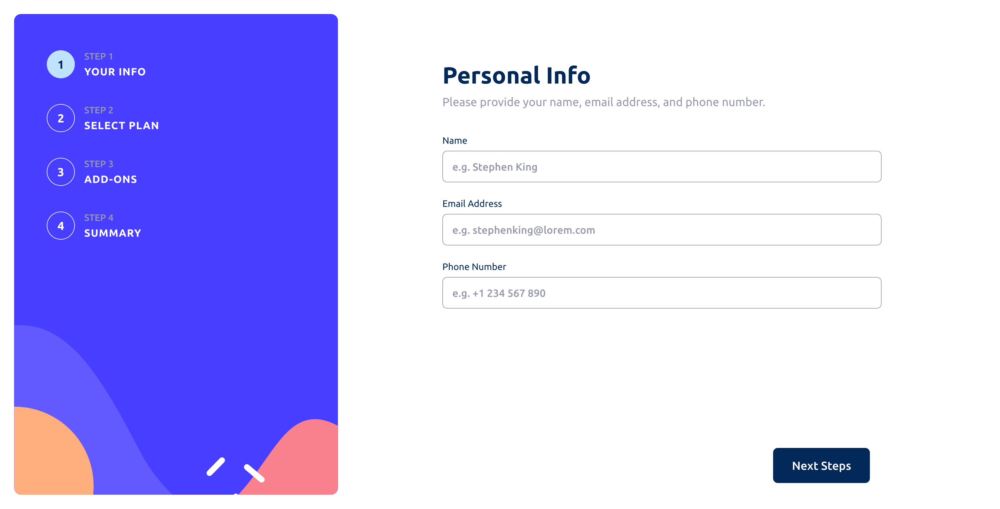

# Frontend Mentor - Multi-step Form Solution

This is my solution to the [Frontend Mentor Multi-step Form challenge](https://www.frontendmentor.io/challenges/multistep-form-YVAnSdqQBJ).

The project is a responsive multi-step form built with React, Next.js, TypeScript, Tailwind CSS, and React Hook Form. Users can enter their personal information, select a plan and billing frequency, choose add-ons, review their selections, and confirm their order.

## Table of contents

- [Overview](#overview)
  - [The challenge](#the-challenge)
  - [Screenshot](#screenshot)
  - [Links](#links)
- [My process](#my-process)
  - [Built with](#built-with)
  - [What I learned](#what-i-learned)
  - [Continued development](#continued-development)
  - [Useful resources](#useful-resources)
  - [AI Collaboration](#ai-collaboration)
- [Author](#author)
- [Acknowledgments](#acknowledgments)

## Overview

### The challenge

Users should be able to:

- Complete each step of the sequence
- Go back to a previous step to update their selections
- See a summary of their selections on the final step and confirm their order
- View the optimal layout for the interface depending on their device's screen size
- See hover and focus states for all interactive elements on the page
- Receive form validation messages if:
  - A field has been missed
  - The email address is not formatted correctly
  - A step is submitted, but no selection has been made

### Screenshot



### Links

* **Solution URL:** [GitHub Repository](https://github.com/otodavid/multi-step-form)
* **Live Site URL:** [multistepsform.vercel.app](https://multistepsform.vercel.app/)

## My process

### Built with

* Semantic HTML5
* Responsive design
* Mobile-first workflow
* Flexbox
* CSS Grid
* [React](https://react.dev/)
* [Next.js](https://nextjs.org/)
* [TypeScript](https://www.typescriptlang.org/)
* [Tailwind CSS](https://tailwindcss.com/)
* [React Hook Form](https://react-hook-form.com/)

### What I learned

This project gave me an opportunity to practice building a multi-step form with React and TypeScript while keeping form state and navigation organized.

#### Managing form state with React Hook Form

I used React Hook Form to manage the form state and validation across the different steps of the form. This allowed the individual form components to share the same form state without having to pass form values through multiple levels of props.

```tsx
const methods = useForm<FormState>({
  defaultValues: {
    name: "",
    email: "",
    phone: "",
    frequency: "monthly",
    plan: "Arcade",
    addons: [],
  },
});
```

I used `FormProvider` and `useFormContext` to make the form methods available throughout the different steps.

#### Validating individual steps

Instead of submitting the entire form when moving between steps, I learned how to validate only the fields belonging to the current step.

```tsx
const isValid = await trigger(["name", "email", "phone"]);

if (!isValid) {
  return;
}
```

This prevents users from progressing to the next step until the required information has been entered correctly.

#### Building a custom toggle

The billing frequency selector required a custom toggle rather than a standard checkbox. I used React Hook Form's `setValue` and `watch` to update and read the current billing frequency.

```tsx
const frequency = watch("frequency");

const handleFrequencyToggle = () => {
  setValue(
    "frequency",
    frequency === "monthly" ? "yearly" : "monthly"
  );
};
```

This helped me understand how to integrate custom UI controls with React Hook Form.

## Continued development

Going forward, I would like to continue improving:

* Form validation and error handling
* Accessibility for custom form controls
* Reusable form components
* State management patterns for larger multi-step forms
* Responsive UI development
* TypeScript patterns for complex forms
* Testing React components and form interactions

I would also like to continue experimenting with different approaches to structuring multi-step forms and handling navigation between steps.

## Useful resources

* [React Hook Form Documentation](https://react-hook-form.com/) - Used to understand form state management, validation, `FormProvider`, `useFormContext`, `watch`, `setValue`, and `trigger`.
* [Next.js Documentation](https://nextjs.org/docs) - Used as a reference while building the application with Next.js.
* [Tailwind CSS Documentation](https://tailwindcss.com/docs) - Used for responsive styling and layout.
* [TypeScript Documentation](https://www.typescriptlang.org/docs/) - Used as a reference for typing form state and React components.
* [Frontend Mentor](https://www.frontendmentor.io/) - Provided the original design and challenge requirements.

## AI Collaboration

I used AI tools, primarily ChatGPT, as a development assistant throughout the project.

I used AI to:

* Debug TypeScript and React issues
* Understand React Hook Form concepts and patterns
* Discuss different approaches to managing multi-step form state
* Review component structure and suggest improvements
* Understand unfamiliar React patterns
* Brainstorm solutions when I encountered implementation problems

AI was mainly used for guidance, debugging, and explaining concepts rather than replacing the development process. I implemented, tested, and adapted the solutions to fit the requirements and structure of the project.

## Author

* Website - [David Ojo](http://multistepsform.vercel.app/)
* Frontend Mentor - [@otodavid](https://www.frontendmentor.io/profile/otodavid)
* GitHub - [@otodavid](https://github.com/otodavid)

## Acknowledgments

Thanks to [Frontend Mentor](https://www.frontendmentor.io/) for providing the design and challenge.